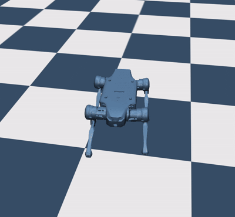

# Lite3 RL Training & Locomotion in MuJoCo

A native, high-efficiency Reinforcement Learning pipeline and simulation environment for the Deep Robotics Lite3 quadruped, built directly in MuJoCo.

## Overview
While the default industry standard for Lite3 development leans heavily on NVIDIA Isaac Sim, this project implements a complete, lightweight RL training and evaluation framework natively in MuJoCo. By avoiding heavy GPU simulation overhead, this repository offers a fast, accessible, and mathematically transparent alternative for developing robust quadrupedal locomotion policies.

## Why MuJoCo?
* **Zero Isaac Sim Overhead:** Runs natively and efficiently on standard workstations without requiring massive GPU compute clusters.
* **Deterministic Contact Physics:** Delivers clean contact modeling, fine-grained control loop tuning, and fast headless stepping.
* **Streamlined Sim-to-Real Alignment:** Simplifies mapping low-level state observations and torque/joint-position actions directly to the physical robot's compute host.

## Key Features
* **Complete RL Pipeline:** End-to-end training utilizing Proximal Policy Optimization (PPO) paired with custom kinematic baselines.
* **Proprioceptive Observation Space:** Full 18-dimensional state feedback including roll, pitch, angular rates, gait phase, and all 12 joint encoders.
* **Smooth Gait Regularization:** Carefully shaped reward structure incorporating action penalties to suppress high-frequency jitter and eliminate limping exploits.
* **High-Speed Watcher:** Real-time evaluation script with tracking camera modes for qualitative gait validation and media logging.

## Core Dependencies
* `mujoco`
* `gymnasium`
* `stable-baselines3`
* `numpy`

## Deployment Roadmap (Sim to Real to follow)
Active development is focused on bridging the policy to physical hardware via the Deep Robotics onboard SDK, mapping the trained PyTorch network weights into real-world motor commands.
